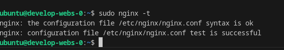

# Домашнее задание к занятию «Продвинутые методы работы с Terraform»

### Цели задания

1. Научиться использовать модули.
2. Отработать операции state.
3. Закрепить пройденный материал.

### Чек-лист готовности к домашнему заданию

1. Зарегистрирован аккаунт в Yandex Cloud. Использован промокод на грант.
2. Установлен инструмент Yandex CLI.
3. Исходный код для выполнения задания расположен в директории [**04/src**](https://github.com/netology-code/ter-homeworks/tree/main/04/src).
4. Любые ВМ, использованные при выполнении задания, должны быть прерываемыми, для экономии средств.

------

### Внимание!! Обязательно предоставляем на проверку получившийся код в виде ссылки на ваш github-репозиторий

Убедитесь что ваша версия **Terraform** ~>1.8.4
Пишем красивый код, хардкод значения не допустимы
------

### Задание 1

1. Возьмите из [демонстрации к лекции готовый код](https://github.com/netology-code/ter-homeworks/tree/main/04/demonstration1) для создания с помощью двух вызовов remote-модуля -> двух ВМ, относящихся к разным проектам(marketing и analytics) используйте labels для обозначения принадлежности.  В файле cloud-init.yml необходимо использовать переменную для ssh-ключа вместо хардкода. Передайте ssh-ключ в функцию template_file в блоке vars ={} .
Воспользуйтесь [**примером**](https://grantorchard.com/dynamic-cloudinit-content-with-terraform-file-templates/). Обратите внимание, что ssh-authorized-keys принимает в себя список, а не строку.
3. Добавьте в файл cloud-init.yml установку nginx.
4. Предоставьте скриншот подключения к консоли и вывод команды ```sudo nginx -t```, скриншот консоли ВМ yandex cloud с их метками. Откройте terraform console и предоставьте скриншот содержимого модуля. Пример: > module.marketing_vm

------

В случае использования MacOS вы получите ошибку "Incompatible provider version" . В этом случае скачайте remote модуль локально и поправьте в нем версию template провайдера на более старую
------


### Ответ

 Консоль Yandex Cloud

 

 Вывод команды nginx -t ВМ1

 

 Вывод команды nginx -t ВМ2

 

 Вывод модуля 1

 

 Вывод модуля 2 

 

### Задание 2

1. Напишите локальный модуль vpc, который будет создавать 2 ресурса: **одну** сеть и **одну** подсеть в зоне, объявленной при вызове модуля, например: ```ru-central1-a```.
2. Вы должны передать в модуль переменные с названием сети, zone и v4_cidr_blocks.
3. Модуль должен возвращать в root module с помощью output информацию о yandex_vpc_subnet. Пришлите скриншот информации из terraform console о своем модуле. Пример: > module.vpc_dev  
4. Замените ресурсы yandex_vpc_network и yandex_vpc_subnet созданным модулем. Не забудьте передать необходимые параметры сети из модуля vpc в модуль с виртуальной машиной.
5. Сгенерируйте документацию к модулю с помощью terraform-docs.

Пример вызова

```
module "vpc_dev" {
  source       = "./vpc"
  env_name     = "develop"
  zone = "ru-central1-a"
  cidr = "10.0.1.0/24"
}
```

### Задание 3

1. Выведите список ресурсов в стейте.
2. Полностью удалите из стейта модуль vpc.
3. Полностью удалите из стейта модуль vm.
4. Импортируйте всё обратно. Проверьте terraform plan. Значимых(!!) изменений быть не должно.
Приложите список выполненных команд и скриншоты процессы.

### Ответ

``` terraform state list ```


``` terraform state rm module.network```


``` terraform state rm module.example-vm module.test-vm ```


``` terraform import module.network.yandex_vpc_network.test enpgar50bkvbg3r7bduk ```


``` terraform import module.network.yandex_vpc_subnet.sub-test e9b2n8ivu9a1oe9h6hf5 ```


```terraform import module.test-vm.yandex_compute_instance.vm[0] fhm3isve52gcvir5il2s```


```terraform import module.example-vm.yandex_compute_instance.vm[0] fhmij7dgemcf3se014```


```terraform plan```

